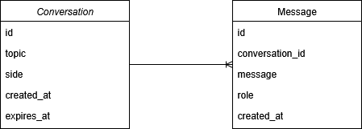

# 🤖 Persuasion Bot
An LLM-based chatbot that takes in messages from a user, processes them, and generates responses intended to defend itself or maintain its position during an ongoing conversation.

## 📜 Table of Contents
1. [Overview](#overview)
2. [Architecture](#architecture)
3. [Entities](#entities)
4. [Tech Stack](#tech-stack)
5. [Getting Started](#getting-started)
6. [API Documentation](#api-documentation)
7. [Example Requests](#example-requests)
8. [Non Functional Requirements](#non-functional-requirements)
9. [Database Optimization](#database-optimization)
10. [Production Considerations](#produciton-considerations)
11. [LLM](#llm)

## Overview
This application challenges you to persuade a chatbot to adopt your point of view while it stands its ground on the initial stance.

Includes:
- Single endpoint to handle messages and responses.
- Conversation history capped at the 5 most recent user+bot pairs.

## Architecture


- **Client**: Anyone consuming the API.
- **API**: REST API built with FastAPI.
- **Database**: ~~In-memory storage for dev/testing~~, PostgreSQL.
- **Cache**: Redis Cache to improve latency and enable rate limiting.

### Caching Strategy

We cache three things to improve latency, cut costs, and avoid duplicate work:

1. Idempotency Keys

    Prevents double processing when clients retry/double-send.

    Key: `idempotency:{request_uuid}` (TTL: 5–15 min).

2. Last Messages (Conversation History Cache)

    Stores last N messages of a conversation.

    Key: `conversation:{conversation_id}:history` (TTL: 30–60 min, reset on activity).

3. LLM Reply Cache

    Re-uses model reply for identical prompt/context.

    Key: `llm:{sha256(model+system_prompts+topic+side+last_K_msgs+user_msg+temperature)}` (TTL: 1–24h).

## Entities


Messages will contain ai prompts and responses.

- ```id```: id autogenerated
- ```conversation_id```: related conversation
- ```message```: message content
- ```role```: message owner (user, bot)
- ```timestamps```

Conversations will be used to link every message based on topic

- ```id```: id autogenerated
- ```side```: wheter bot will be against or in favor of (con, pro)
- ```topic```: subject of a conversation or discussion.
- ```timestamps```

## Tech Stack
- **Backend**: FastAPI (Python 3.9+)
- **Database**: ~~In-memory dict for dev/testing~~, PostgreSQL.
- **API Docs**: Swagger UI / ReDoc (auto-generated)
- **Containerization**: Docker

## Getting Started

### Prerequisites (Docker-first)
- Docker (required)
    - Follow Docker installation [instructions](https://docs.docker.com/engine/install/)
- GNU Make (required)
    - On Linux/macOS: preinstalled or install via package manager (sudo apt install make, brew install make)

    - On Windows: install via Chocolatey (choco install make) or MSYS2
- Python & pip (optional, for local-only dev/tests)
- PostgreSQL (optional, for local-only dev)

### Clone Repository
```bash
git clone https://github.com/gonzasestopal/persuasion_bot.git
cd persuasion_bot
```

### Environment
Copy .env.example to .env and adjust if needed:
```
POSTGRES_USER=app
POSTGRES_PASSWORD=app
POSTGRES_DB=app
DATABASE_URL=postgresql://app:app@db:5432/app
```

### Running the service
```
make run
```

### Running tests
```
make test
```

### Cleanup
```
make down   # stop Docker services if running (no-op if none exist)
make clean  # remove venv, caches, __pycache__
```

## API Documentation

Base URL:
- **Local:** `http://localhost:8000`

Authentication:
- None is required

### Messages
| Method | Endpoint                 | Description
|--------|--------------------------|-------------------------------------
| POST   | `/messages`              | Inserts a new message / Starts convo

## Example Requests

>  [!IMPORTANT]
>  Make sure the starting message contains topic and side (PRO, CON) in any order.<br>
>  Topic: Dogs are humans best friend Side: pro

**Start a new conversation**
```http
POST /messages HTTP/1.1
Host: http://localhost:8000
Content-Type: application/json
```

```
{
    "conversation_id": null,
    "message": "Topic: Sports are one of the best ways to build discipline and strengthen community bonds. Side: PRO."
}
```
**Response 201**
```
{
    "conversation_id": "1",
    "message": [
        {
            "role": "user",
            "message": "Topic: Sports are one of the best ways to build discipline and strengthen community bonds. Side: PRO."
        },
        {
            "role": "bot",
            "message": "I will gladly take the PRO side. Sports are key in shaping discipline..."
        }
    ]
}
```

**Continue an existing conversation**
```http
POST /messages HTTP/1.1
Host: http://localhost:8000
Content-Type: application/json
```

```
{
    "conversation_id": 1,
    "message": "But sports also divide people"
}
```

**Response 200**
```
{
    "conversation_id": 1,
    "message": [
        {
            "role": "user",
            "message": "Topic: Sports are one of the best ways to build discipline and strengthen community bonds. Side: PRO."
        },
        {
            "role": "bot",
            "message": "I will gladly take the PRO side. Sports are key in shaping discipline..."
        },
        {
            "role": "user",
            "message": "But sports also divide people."
        },
        {
            "role": "bot",
            "message": "I formly believe that sports can unite and divide people in the same amount, only fanatism is the real problem."
        }
    ]
}
```

**Error Examples**
```
{ "detail": "message must not be empty." }                                       # 422 Unprocessable Entity
{ "detail": "message must contain topic and side for starting a conversation." } # 422 Unprocessable Entity
{ "detail": "conversation_id must be null when starting a conversation" }        # 422 Unprocessable Entity
{ "detail": "conversation_id not found or expired" }                             # 404 Not Found
{ "detail": "response generation timed out" }                                    # 503 Bad Gateway
```

## Non Functional Requirements

**Latency**: Response < 30s (hard API cap). Internal timeout enforced at 25s.

**Scalability**: Caching layers reduce duplicate LLM calls and DB load.

**History Window**: Only the last 5 user+bot pairs are returned in responses, taking in consideration the following approaches:

- A) Soft-delete (mark older rows as deleted)

- B) Don’t delete; select “latest N” with a subquery (and reorder ascending)

For this implementation I went with the subquery approach because it’s simpler and keeps the write path lightweight. A soft-delete strategy would allow undelete/auditability, but it also incurs extra overhead by updating indexes

**Fault Tolerance**: If timeout triggers, bot responds with a short fallback argument.

**Storage**: Conversations expire after 60 minutes of inactivity.

## Database Optimization

- **conversations (expires_at)**
  - Speeds up lookups for active conversations (`expires_at > NOW()`)
  - Used in cleanup job to quickly delete expired rows

- **messages (conversation_id, created_at)**
  - Optimizes retrieval of the last N messages for a conversation
  - Maintains ordering by creation time for fast sequential reads

- **messages (conversation_id, created_at DESC, id DESC)**
  - Optimizes “latest N” queries like `WHERE conversation_id = $1 ORDER BY created_at DESC, id DESC LIMIT $2` by satisfying both sort keys from the index (often avoiding an extra sort).
  - Uses the monotonic primary key `id` as a deterministic tie-breaker when multiple rows share the same `created_at`, preserving user→bot ordering as required.

## Production Considerations

For simplicity, expired conversations will not be physically deleted from the database in this implementation. In a production system, you would typically run a periodic cleanup job to purge expired rows.

## LLM
We consider both antropic and openAI providers for this project. But we prioritize models with fast response for our low latency cap, theres no token limit (hard requirement) or costs related requirement so we dont take that in account.

I made an approximate calculation token usage for medium-resistance debate bot.

Since max history is capped at 10 messages (user, bot) we only have to take in consideration message history token less 3000 units than and output tokens less than 400 units.

>  [!IMPORTANT]
> Keep prompt ≤ 2.5–3k tokens: last 5 user + 5 bot turns, plus a 120–180-token rolling summary.
> Summarize oversized user turns to ≤600 tokens before passing to the model.

### GPT-4o
Optimized for speed: first tokens in ~1–2s, full ~300–500 token reply often well under 10s.

Even long (1k–1.5k token) answers usually <20s.

### Claude 3.5
Sonnet: typically <10s for medium answers; competitive with GPT-4o.

Opus: slower — long answers can push past 30s if you don’t stream or limit length.

Streaming works but isn’t quite as snappy as GPT-4o.

### Conclusion
Given our strict <30 s response time requirement, GPT-4o is our safer default: it delivers first tokens in ~1–2 s and completes medium answers in under 10 s, with predictable throughput. Claude 3.5 Sonnet is a viable alternative when longer context or a more conversational style is desired, but requires stricter output caps to guarantee latency. Claude 3.5 Opus is excluded due to its slower generation speed, which risks breaching our latency SLA.
