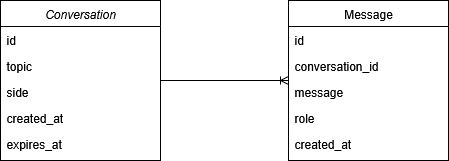

# 🤖 Persuation Bot
An LLM-based chatbot that takes in messages from a user, processes them, and generates responses intended to defend itself or maintain its position during an ongoing conversation.

## 📜 Table of Contents
1. [Overview](#overview)
2. [Architecture](#architecture)
3. [Entities](#entities)
4. [Tech Stack](#tech-stack)
5. [API Documentation](#api-documentation)
6. [Example Requests](#example-requests)

## Overview
This application challenges you to persuade a chatbot to adopt your point of view.

Includes:
- Single endpoint to handle messages and responses.

## Architecture


- **Client**: Anyone consuming the API.
- **API**: REST API built with FastAPI.
- **Database**: Volatile Inmemory storage for message storage.
- **Cache**: Redis Cache to improve Latency and Rate Limiting

### Caching Strategyy
We cache three things to improve latency, cut costs, and avoid duplicate work:

**Idempotency Keys**

- What: A short-lived record of processed POST requests.

- Why: Prevents double processing when clients retry or double-send.

- Key: idempotency:{request_uuid}
TTL: 5–15 min.

**Last Messages** (Conversation History Cache)

- What: The last N messages for a conversation.

- Why: Builds LLM context without hitting the database each turn.

- Key: conversation:{conversation_id}:history

- TTL: 30–60 min (reset on activity).

**LLM Reply Cache**

- What: The model’s reply for an identical prompt/context.

- Why: Skips repeat LLM calls on retries or duplicate user inputs.

- Key: llm:{sha256(model + system_prompts + subject + side + last_K_msgs + user_msg + temperature)}

- TTL: 1–24 h (depends on how stable you want outputs to be).

## Entities


Messages will contain ai prompts and responses.

- ```id```: id autogenerated
- ```conversation_id```: related conversation
- ```message```: message content
- ```role```: message owner (user, bot)
- ```timestamps```

Conversations will be used to link every message based on topic

- ```id```: id autogenerated
- ```side```: wheter bot will be against or in favor of (side, pro)
- ```topic```: subject of a conversation or discussion.
- ```timestamps```

## Tech Stack
- **Backend**: FastAPI (Python 3.11+)
- **Database**: Dict and postgres for production
- **API Docs**: Swagger UI / ReDoc (auto-generated)
- **Containerization**: Docker

## API Documentation

Base URL:
- **Local:** `http://localhost:8000`

Authentication:
- None is required

### Messages
| Method | Endpoint                 | Description
|--------|--------------------------|-------------------------------------
| POST   | `/messages`              | Inserts a new message / Starts convo

## Example Requests

**POST /messages**
```http
POST /messages HTTP/1.1
Host: http://localhost:8000
Content-Type: application/json
```

```
{
    "conversation_id": null,
    "message": "Topic: Sports are one of the best ways to build discipline and strengthen community bonds. Side: PRO."
}
```
**Response 201**
```
{
    "conversation_id": "1",
    "message": [
        {
            "role": "user",
            "message": "Topic: Sports are one of the best ways to build discipline and strengthen community bonds. Side: PRO."
        },
        {
            "role": "bot",
            "message": "I will gladly take the PRO side. Sports are key in shaping discipline..."
        }
    ]
}
```

**POST /messages**
```http
POST /messages HTTP/1.1
Host: http://localhost:8000
Content-Type: application/json
```

```
{
    "conversation_id": 1,
    "message": "But sports also divide people"
}
```

**Response 200**
```
{
    "conversation_id": 1,
    "message": [
        {
            "role": "user",
            "message": "Topic: Sports are one of the best ways to build discipline and strengthen community bonds. Side: PRO."
        },
        {
            "role": "bot",
            "message": "I will gladly take the PRO side. Sports are key in shaping discipline..."
        },
        {
            "role": "user",
            "message": "But sports also divide people."
        },
        {
            "role": "bot",
            "message": "I formly believe that sports can unite and divide people in the same amount, only fanatism is the real problem."
        }
    ]
}
```

**Response 422**
```
{
  "detail": "message must not be empty."
}
```

**Response 422**
```
{
  "conversation_id must be null when starting a conversation"
}
```

**Response 422**
```
{
  "detail": "conversation_id not found or expired"
}
```

**Response 504**
```
{
  "detail": "response generation timed out"
}

